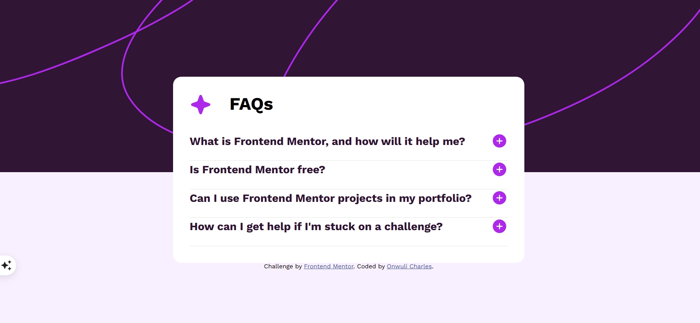

# Frontend Mentor - FAQ accordion solution

This is a solution to the [FAQ accordion challenge on Frontend Mentor](https://www.frontendmentor.io/challenges/faq-accordion-wyfFdeBwBz). Frontend Mentor challenges help you improve your coding skills by building realistic projects. 

## Table of contents

- [Overview](#overview)
  - [The challenge](#the-challenge)
  - [Screenshot](#screenshot)
  - [Links](#links)
- [My process](#my-process)
  - [Built with](#built-with)
  - [What I learned](#what-i-learned)
  - [Continued development](#continued-development)
  - [Useful resources](#useful-resources)
- [Author](#author)


## Overview

### The challenge

Users should be able to:

- Hide/Show the answer to a question when the question is clicked
- Navigate the questions and hide/show answers using keyboard navigation alone
- View the optimal layout for the interface depending on their device's screen size
- See hover and focus states for all interactive elements on the page

### Screenshot




### Links

- Solution URL: https://github.com/Ot-Charlie/faq-accordion-main
- Live Site URL:(https://ot-charlie.github.io/faq-accordion-main/)

## My process

### Built with

- Semantic HTML5 markup
- CSS custom properties
- Flexbox
- CSS Grid
- Desktop-first workflow


### What I learned
This project was very important as it taught me the importance of proper html structuring. 
I learnt how to properly wrap images and texts so as to make styling easier 
To see how you can add code snippets, see below:

```html
<div class="accordion-container">
        <div class="accordion-header">
          <h2>What is Frontend Mentor, and how will it help me?</h2>
          
        </div>
        <p class="accordion-content">Frontend Mentor offers realistic coding challenges to help
          developers improve their frontend coding skills with projects in
          HTML, CSS, and JavaScript. It's suitable for all levels and ideal for
          portfolio building.
        </p>
      </div>
```
```
```if (!isActive) {
            content.classList.add('active');
            icon.src = './assets/images/icon-minus.svg';
        }
```


### Continued development
For continued development I want to work on my Javascript, I want to continue to hone my semantic skills too so I can achieve clean code that is easier to style too.

### Useful resources

- (https://www.w3schools.com/) - This helped to explain concepts as simply as possible. 
- (https://claude.ai/new) - Really helped me out with my Javascript and advised me on how to go about placing the accordion icons in a clean and stress free way.


## Author

- Website - [Add your name here](https://stately-unicorn-cddab4.netlify.app)
- Frontend Mentor - [@yourusername](https://www.frontendmentor.io/profile/ot.charlie)
- Twitter - [@yourusername](https://www.twitter.com/@kingcharlie01)


